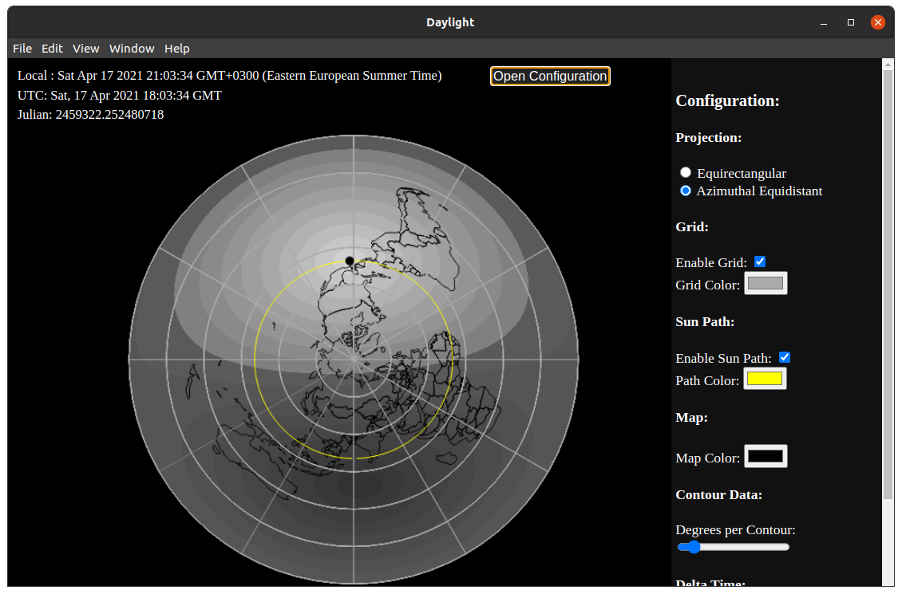
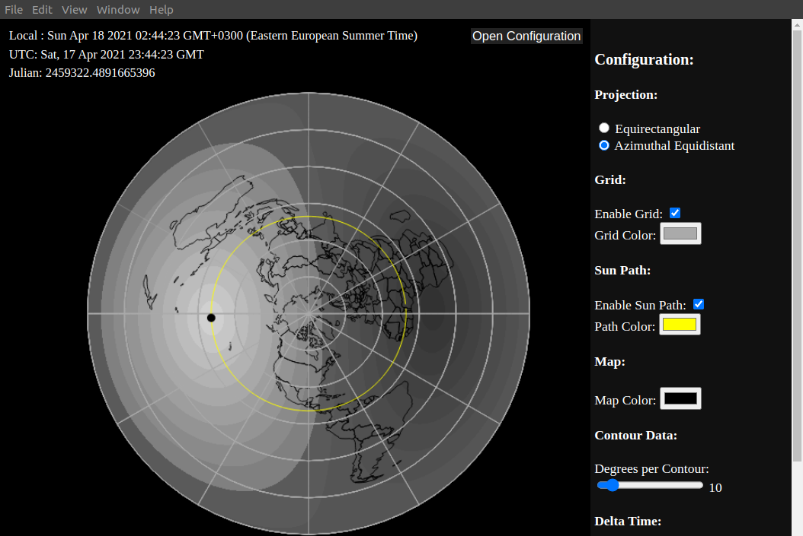

# sunangle

HTML canvas visualization of the Sun altitude in a daylight map with 
filled contours. This is the first non-trivial application I have written in JavaScript.
The drawing of the contour data is somewhat slow and could probably be 
improved. When in full screen mode, the drawing can be made faster by 
increasing the zoom.

Click below to execute in browser.

